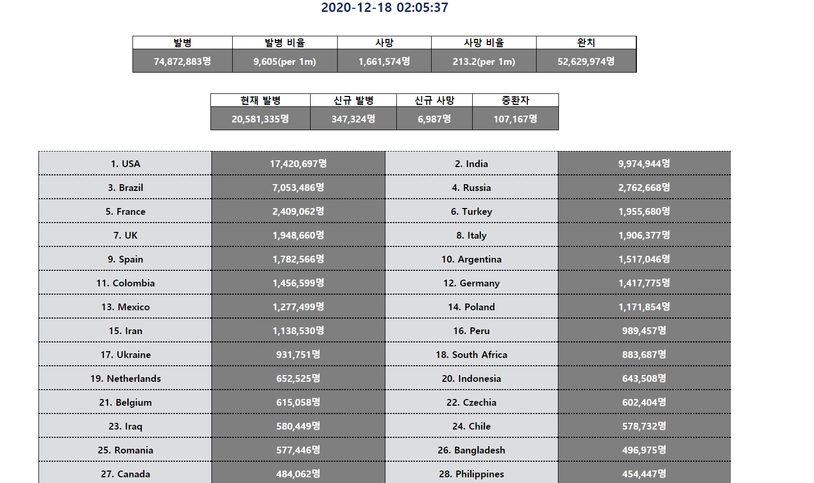

# Corona_data

[구경하기](https://chkim116.github.io/corona_data/)

## Reason

#### Why?

Corona data 페이지는 오픈되어있는 코로나 질병 현황 API를 활용해 표를 만들어 현재 환자 수, 신규 환자 수 등의 데이터들을 눈으로도 쉽게 확인하고자 했습니다.

#### Info

오픈 API를 활용한 전세계 코로나 현황 데이터 표

 
 

## Features

<ul>
<li><a href="#stat">코로나 표 데이터</a></li>
</ul>

 
 

#### <a id="stat" style="color: black">코로나 표 데이터 </a>

